# Diagram types: one verified example each

Every example below renders with the bundled Pele (Mermaid 12.1 syntax). Copy
the shape, replace the content. Lines starting with `%%` are comments.

## flowchart

Shapes: `[box]`, `(rounded)`, `([stadium])`, `{diamond}`, `[(cylinder)]`,
`((circle))`. Edges: `-->`, `-- text -->`, `-.->` dotted, `==>` thick.

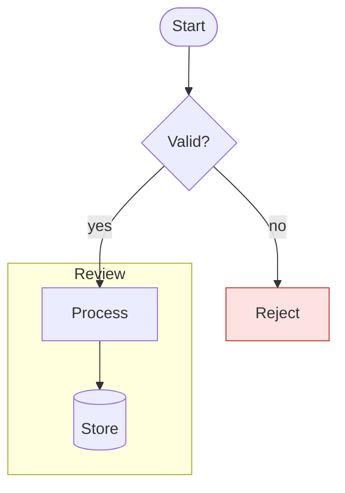
```mermaid
flowchart TD
  A([Start]) --> B{Valid?}
  B -- yes --> C[Process]
  B -- no --> D[Reject]
  C --> E[(Store)]
  subgraph Review
    C
    E
  end
  style D fill:#fde2e2,stroke:#c0392b
```

## swimlane-beta

A flowchart whose nodes live in lanes (one `subgraph` per lane).

```mermaid
swimlane-beta LR
  subgraph Customer
    browse[Browse catalogue]
    pay[Pay]
  end
  subgraph Warehouse
    pick[Pick items]
    ship[Ship order]
  end
  browse --> pay --> pick --> ship
```

## sequenceDiagram

Arrows: `->>` solid, `-->>` dashed reply, `-x` lost. `activate`/`deactivate`,
`loop`, `alt`/`else`, `opt`, `par`, `Note over A,B: text`.

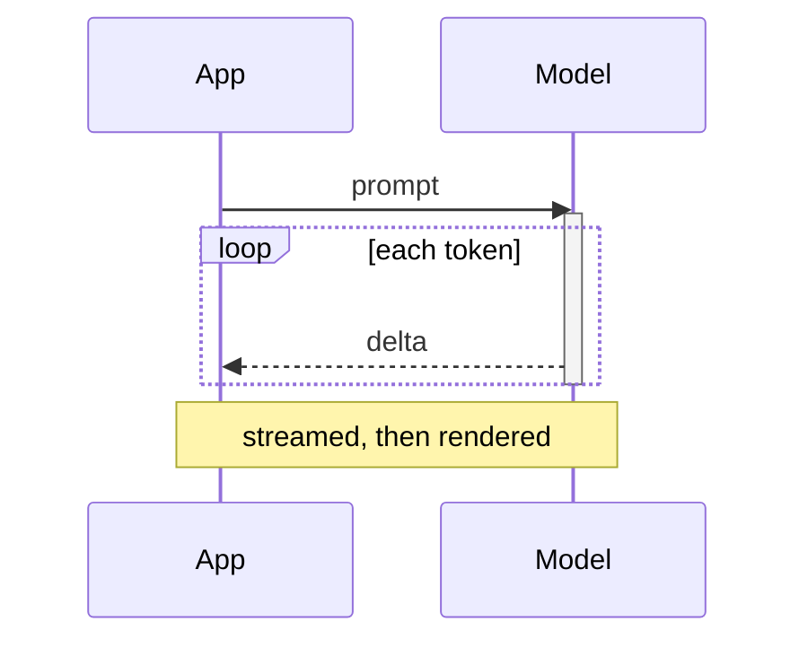
```mermaid
sequenceDiagram
  participant App
  participant Model
  App->>Model: prompt
  activate Model
  loop each token
    Model-->>App: delta
  end
  deactivate Model
  Note over App,Model: streamed, then rendered
```

## classDiagram

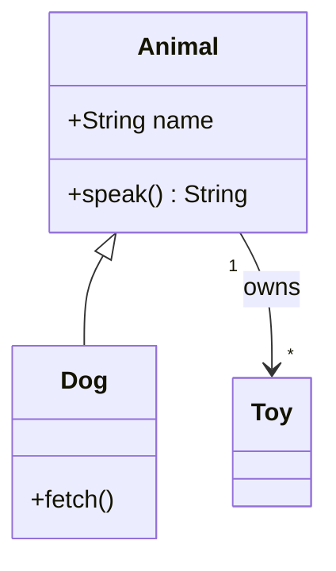
```mermaid
classDiagram
  class Animal {
    +String name
    +speak() String
  }
  class Dog {
    +fetch()
  }
  Animal <|-- Dog
  Animal "1" --> "*" Toy : owns
```

## stateDiagram-v2

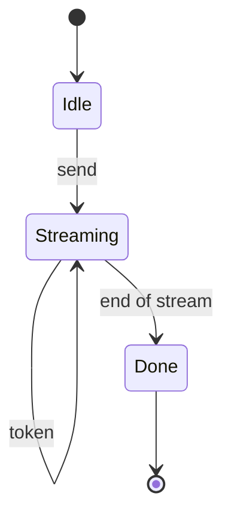
```mermaid
stateDiagram-v2
  [*] --> Idle
  Idle --> Streaming : send
  Streaming --> Streaming : token
  Streaming --> Done : end of stream
  Done --> [*]
```

## erDiagram

Cardinality: `||` one, `o|` zero or one, `}|` one or more, `o{` zero or more.

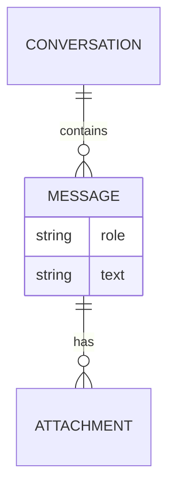
```mermaid
erDiagram
  CONVERSATION ||--o{ MESSAGE : contains
  MESSAGE ||--o{ ATTACHMENT : has
  MESSAGE {
    string role
    string text
  }
```

## architecture-beta

Icons: `cloud`, `database`, `disk`, `internet`, `server`. Edge ends name a
side: `T`, `B`, `L`, `R`.

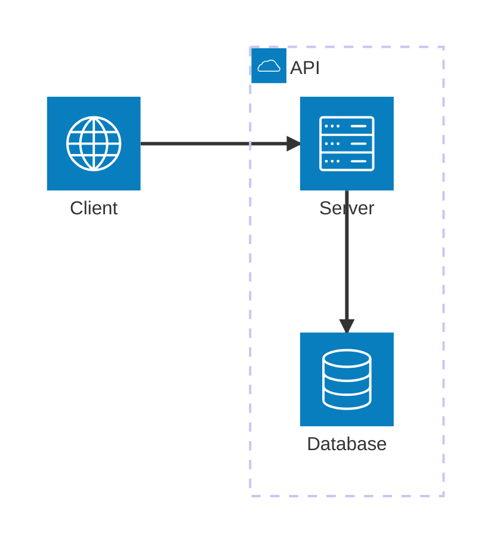
```mermaid
architecture-beta
  group api(cloud)[API]
  service db(database)[Database] in api
  service server(server)[Server] in api
  service client(internet)[Client]
  client:R --> L:server
  server:B --> T:db
```

## C4Context

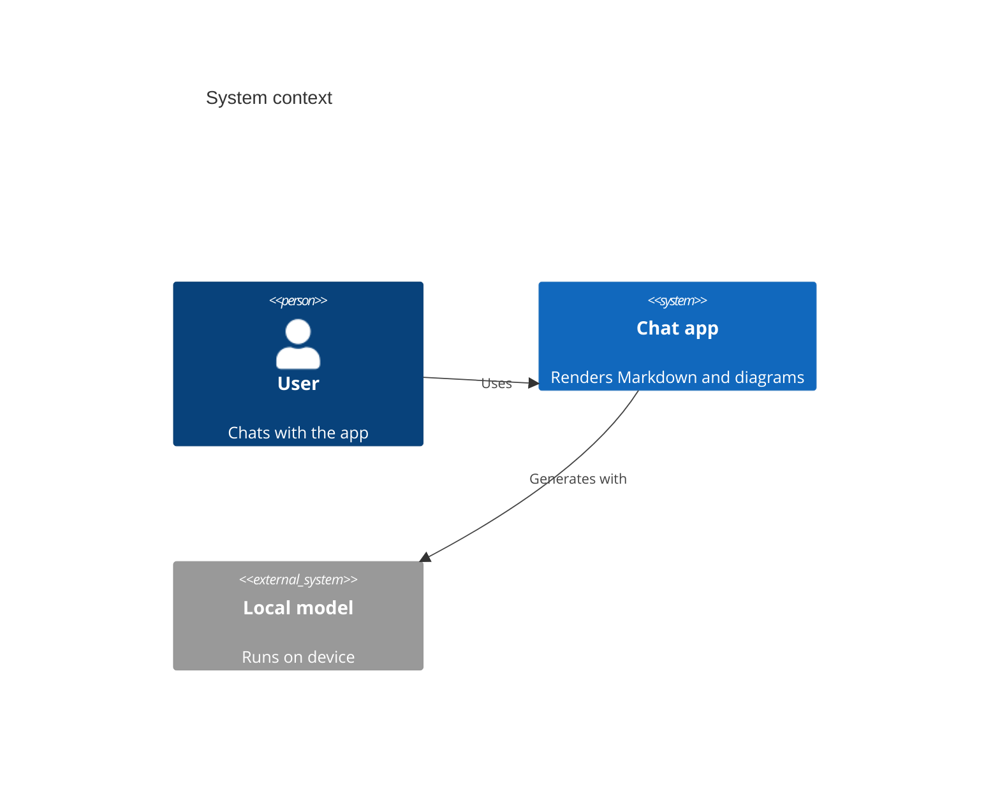
```mermaid
C4Context
  title System context
  Person(user, "User", "Chats with the app")
  System(app, "Chat app", "Renders Markdown and diagrams")
  System_Ext(model, "Local model", "Runs on device")
  Rel(user, app, "Uses")
  Rel(app, model, "Generates with")
```

## gantt

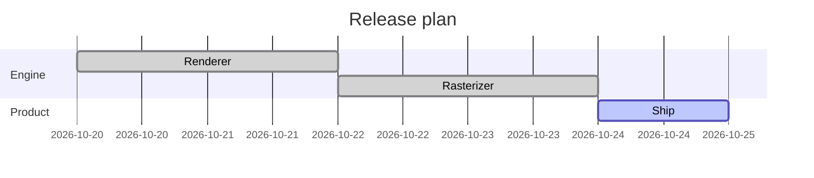
```mermaid
gantt
  title Release plan
  dateFormat YYYY-MM-DD
  section Engine
  Renderer       :done, a1, 2026-10-20, 2d
  Rasterizer     :done, a2, after a1, 2d
  section Product
  Ship           :active, a3, after a2, 1d
```

## timeline

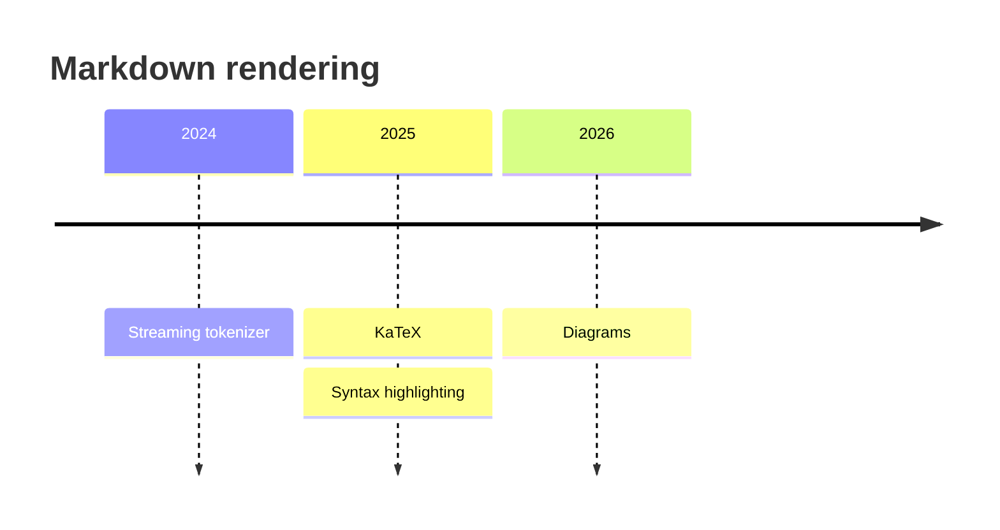
```mermaid
timeline
  title Markdown rendering
  2024 : Streaming tokenizer
  2025 : KaTeX
       : Syntax highlighting
  2026 : Diagrams
```

## gitGraph

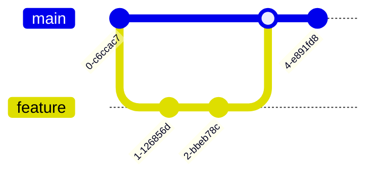
```mermaid
gitGraph
  commit
  branch feature
  commit
  commit
  checkout main
  merge feature
  commit
```

## mindmap

Indentation is the structure. Shapes: `root((text))`, `(rounded)`, `[square]`.

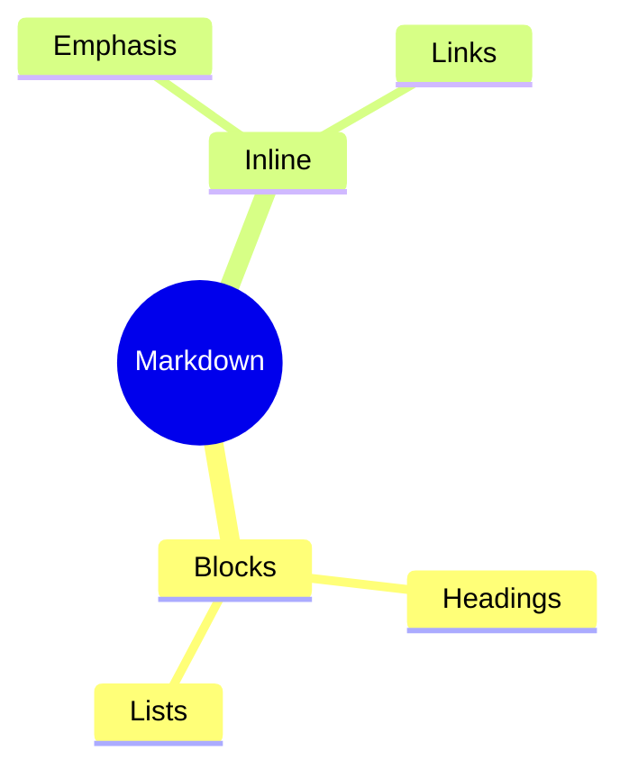
```mermaid
mindmap
  root((Markdown))
    Blocks
      Headings
      Lists
    Inline
      Emphasis
      Links
```

## treeView-beta

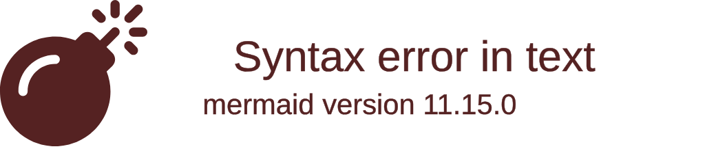
```mermaid
treeView-beta
  src/
    App.swift
    Views/
      ContentView.swift
  Package.swift
```

## ishikawa-beta

First line is the effect; categories, then causes, by indentation.

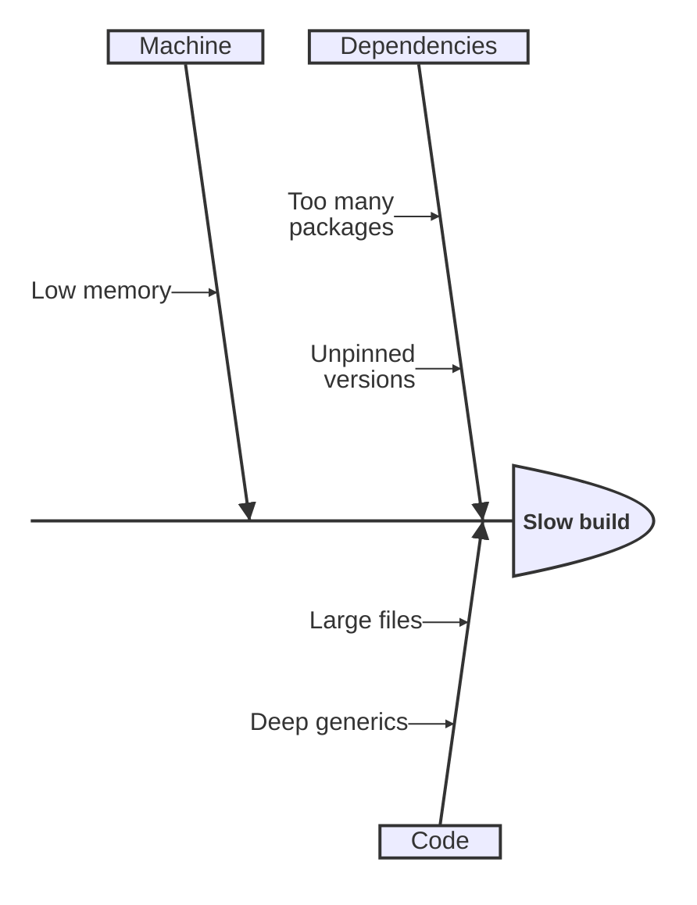
```mermaid
ishikawa-beta
  Slow build
  Dependencies
    Too many packages
    Unpinned versions
  Code
    Large files
    Deep generics
  Machine
    Low memory
```

## kanban

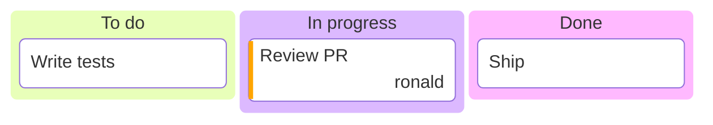
```mermaid
kanban
  todo[To do]
    t1[Write tests]
  doing[In progress]
    t2[Review PR]@{ assigned: "ronald", priority: "High" }
  done[Done]
    t3[Ship]
```

## pie

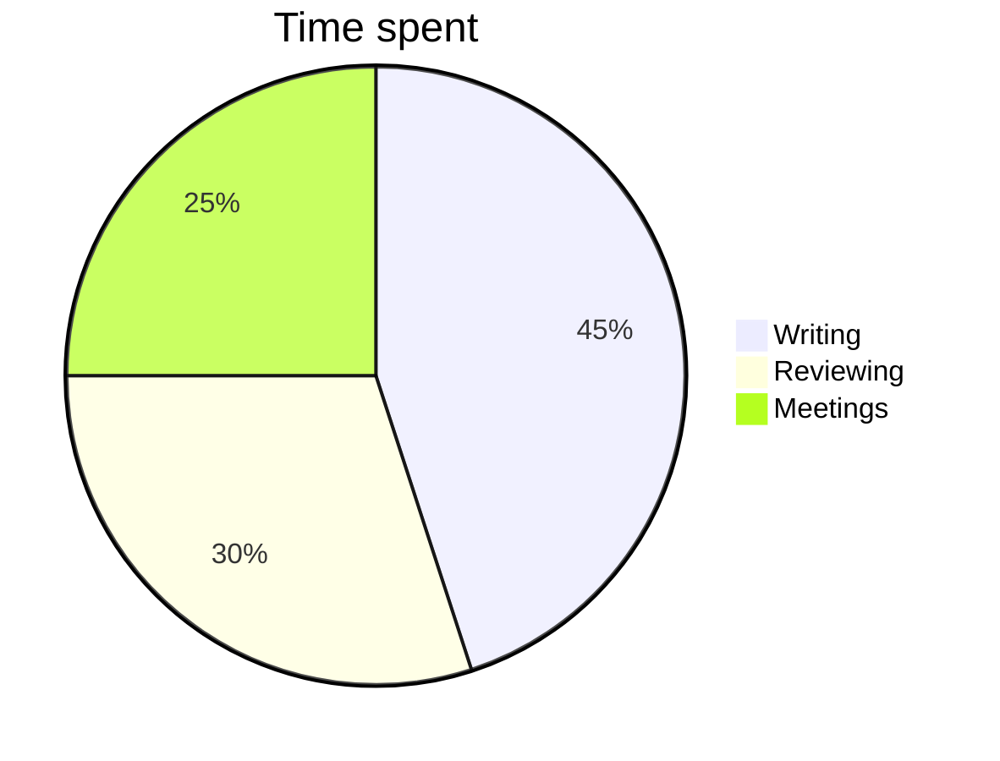
```mermaid
pie title Time spent
  "Writing" : 45
  "Reviewing" : 30
  "Meetings" : 25
```

## treemap-beta

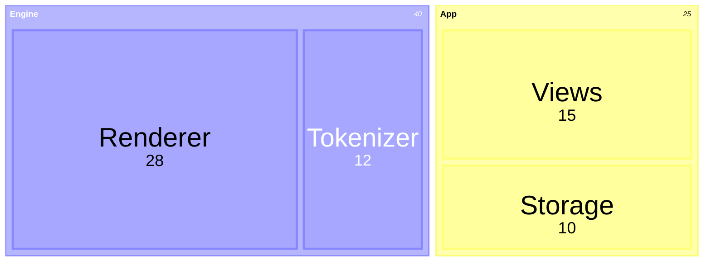
```mermaid
treemap-beta
"Engine"
    "Tokenizer": 12
    "Renderer": 28
"App"
    "Views": 15
    "Storage": 10
```

## xychart-beta

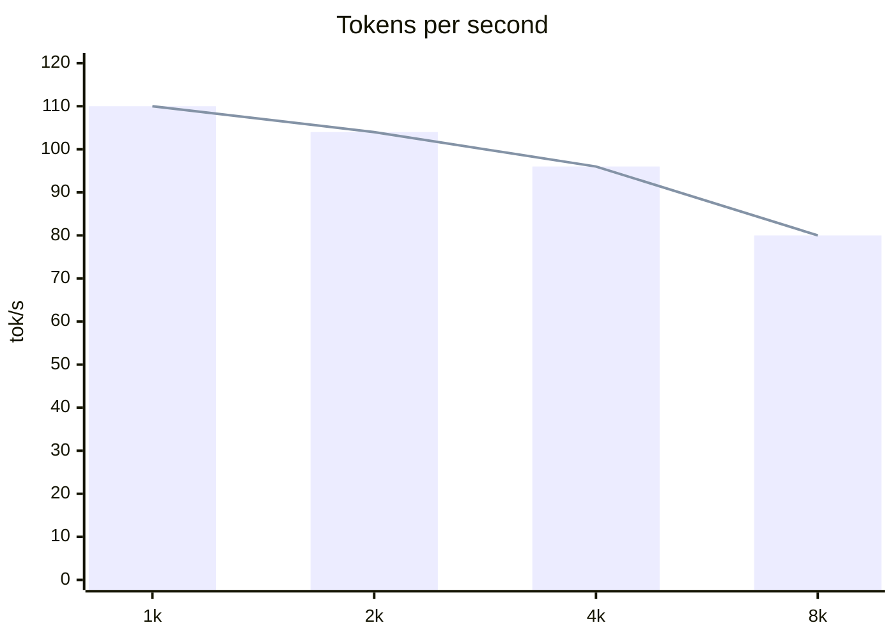
```mermaid
xychart-beta
  title "Tokens per second"
  x-axis [1k, 2k, 4k, 8k]
  y-axis "tok/s" 0 --> 120
  bar [110, 104, 96, 80]
  line [110, 104, 96, 80]
```

## radar-beta

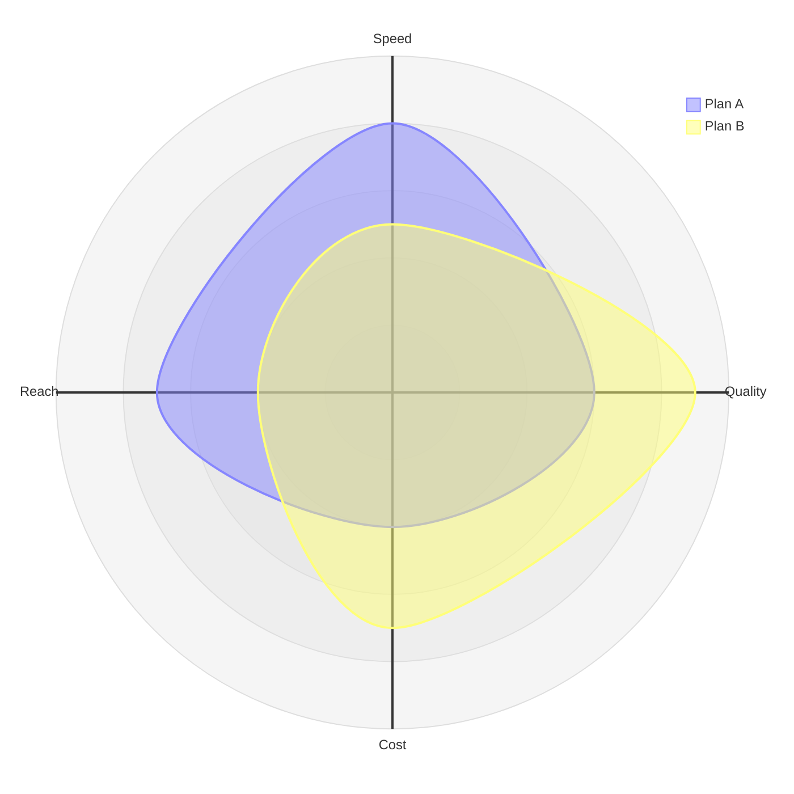
```mermaid
radar-beta
  axis s["Speed"], q["Quality"], c["Cost"], r["Reach"]
  curve a["Plan A"]{80, 60, 40, 70}
  curve b["Plan B"]{50, 90, 70, 40}
  max 100
  min 0
```

## quadrantChart

Points are `[x, y]` in 0 to 1.

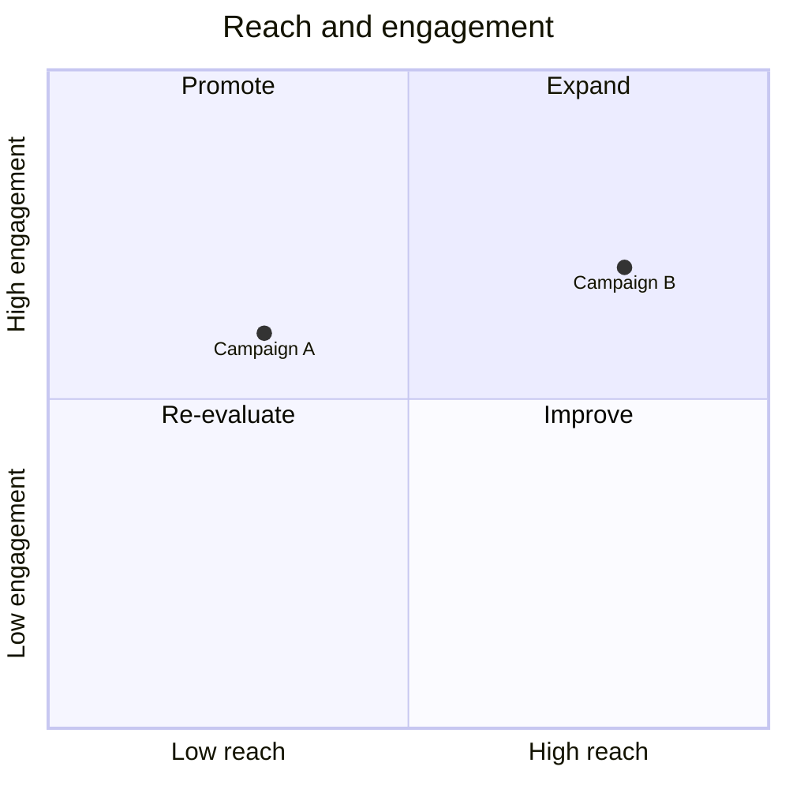
```mermaid
quadrantChart
  title Reach and engagement
  x-axis Low reach --> High reach
  y-axis Low engagement --> High engagement
  quadrant-1 Expand
  quadrant-2 Promote
  quadrant-3 Re-evaluate
  quadrant-4 Improve
  Campaign A: [0.3, 0.6]
  Campaign B: [0.8, 0.7]
```

## sankey-beta

CSV: source, target, value.

```mermaid
sankey-beta
Prompt,Model,60
Context,Model,40
Model,Answer,80
Model,Discarded,20
```

## venn-beta

```mermaid
venn-beta
  set A["Frontend"]
    text A1["React"]
  set B["Backend"]
    text B1["API"]
  union A,B["Shared"]
    text AB1["OpenAPI"]
```

## usecase-beta

```mermaid
usecase-beta
direction LR
actor Customer("Customer")
systemBoundary "Order system"
  Checkout("Place order")
  Track("Track order")
end
Customer --> Checkout
Customer --> Track
```

## packet

Bit ranges, in order. `+16` means the next 16 bits.

```mermaid
packet
title UDP header
+16: "Source port"
+16: "Destination port"
32-47: "Length"
48-63: "Checksum"
```

## railroad-ebnf-beta

```mermaid
railroad-ebnf-beta
expression = term ( ( "+" | "-" ) term )* ;
term = "number" ;
```

## wardley-beta

Components are placed by `[visibility, evolution]` in 0 to 1.

```mermaid
wardley-beta
title Tea shop
component Cup of tea [0.79, 0.61]
component Kettle [0.43, 0.35]
component Power [0.10, 0.70]
Cup of tea -> Kettle
Kettle -> Power
evolve Kettle 0.62
```

## agentflow-beta

Shapes: `task`, `decision`, `action`, `tool`, `input`, `refdoc`. `flow` groups
an agent's steps.

```mermaid
agentflow-beta TB
  flow researcher["Researcher"]
    gather["Gather sources"]@{ shape: task }
  end
  flow writer["Writer"]
    draft["Compose draft"]@{ shape: task }
    check["Good enough?"]@{ shape: decision }
  end
  gather --> draft --> check
  check -- no --> draft
```

## cynefin-beta

```mermaid
cynefin-beta
  title Incident response
  complex
    "Investigate root cause"
  complicated
    "Expert review"
  clear
    "Apply known fix"
  chaotic
    "Page on-call now"
```

## eventmodeling

Swimlanes: `ui`, `cmd` (command), `evt` (event), `rmo` (read model).
`tf` timeline frame, `rf` reference frame.

```mermaid
eventmodeling

tf 01 ui CartUI
tf 02 cmd AddItem
tf 03 evt ItemAdded
tf 04 rmo CartItems
```

## requirementDiagram

```mermaid
requirementDiagram
  requirement fast_render {
    id: 1
    text: A diagram renders within 50 ms.
    risk: medium
    verifymethod: test
  }
  element rasterizer {
    type: component
  }
  rasterizer - satisfies -> fast_render
```

## block-beta

```mermaid
block-beta
  columns 3
  a["Input"] b["Process"] c["Output"]
  a --> b
  b --> c
```

## journey

```mermaid
journey
  title Asking a question
  section Ask
    Type the question: 5: User
    Wait for the answer: 3: User
  section Read
    See the diagram: 5: User
```
